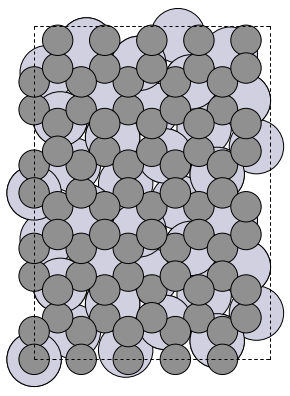

# Supercells
## Search, Construction, and Analysis of Graphene-Substrate Supercells
A Python program for searching, constructing, and analyzing supercells of graphene-substrate heterostructures.

## Features
- Search for unique supercells with specified parameters:

  - Substrate type

  - Lattice parameters of graphene and substrate
  - Maximum supercell vector length
  - Maximum lattice mismatch
  - Maximum anisotropy (difference in mismatch between the two supercell vectors)
  - Constraints on the angle between supercell vectors (beta angle)
  - Rhombicity requirement for supercells

A unique supercell is defined by a unique combination of: beta angle, vector lengths, mismatch parameters, and the rotation angle of the graphene lattice relative to the substrate lattice - alpha angle.

- Construction of found supercells and saving in ase.Atoms format with support for the following substrate types:

    - FCC (100, 110, 111)
    - BCC (100, 110, 111)
    - HCP (0001)
    - Diamond (100, 111)

-Export/import of supercells and data processing using `pandas`

## Requirements

- Python 3.8+
- NumPy
- pandas
- ASE (Atomic Simulation Environment)

## Usage Examples
### 1. Searching for Supercells

Search for supercells on platinum substrate with (110) surface using experimental lattice constants. Maximum supercell vector length: 20 Å, maximum mismatch parameter: 6%, beta angle: any, vector length ratio: any, maximum mismatch difference: 4%, output brief information about found supercells to file: True.

```python
from supercell import Supercell()
Pt_fcc110 = Supercell()
Pt_fcc110.set_me(title_me='Pt', lat_me='fcc110')
Pt_fcc110_supercells = Pt_fcc110.search_supercell(radius=20, eps_max=6, beta_fix=False, eq_abs=False, eq_eps=4, csv=True)
```

### 2. Building Supercells
Build the third found supercell with 3 substrate layers and save the results: structure in .xyz format and top view image in .png format.

```python
from ase.io import write
from IPython.display import Image, display

atoms = Pt_fcc110.build_supercell(mg_supercell=Pt_fcc110_supercells[2], n_me_layers=3, directory_res='./data')
write('./data/Pt_fcc110_1.xyz', atoms)
write('./data/Pt_fcc110_1.png', atoms)
display(Image(filename='data/Pt_fcc110_1.png'))
```


### 3. Calculating Mismatch and Deformation
Calculate the mismatch matrix in the basis of vectors parallel and perpendicular to the C-C bond, and calculate the deformation of graphene along the C-C bond and perpendicular to it, taking into account shear deformation.

```python
supercell_test = Pt_fcc110_supercells[2]
eps_matrix = Pt_fcc110.compute_mismatch_in_basis(supercell_test)
print('Mismatch matrix: \n', eps_matrix)
eps_cc, eps_orth_cc = Pt_fcc110.compute_deform_of_cc(mg_supercell=supercell_test)
print(f'Deformation: {eps_cc:.4f} {eps_orth_cc:.4f}')
```